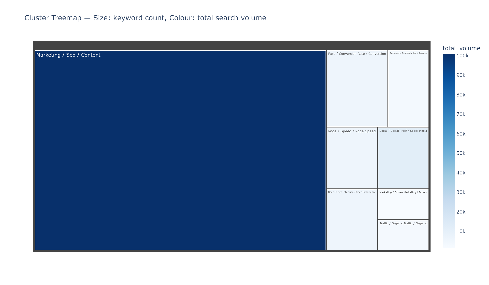

# SEO Keyword Clustering & Topic Mapping

[](https://github.com/johnoconnor0/keyword-clustering/actions/workflows/ci.yml)
[](LICENSE)
[](https://www.python.org/downloads/)
[](https://streamlit.io)

> Interactive SEO keyword clustering, page mapping, and content-gap analysis with 2D/3D visualisations, CSV exports, and a Streamlit dashboard.

<p align="center">
  
</p>

---

## What it does

- **Clusters keywords** with `kmeans`, `agglomerative`, `hdbscan`, and `graph` methods
- **Supports hybrid similarity** (semantic + TF-IDF + optional SERP overlap)
- **Maps keyword groups** to your website pages via cosine similarity
- **Detects content gaps** — keywords with no suitable target page
- **Flags cannibalization** — clusters where multiple pages compete for the same intent
- **Flags page mismatches** — keywords currently ranking on the wrong page
- **Scores opportunities** — prioritises keywords by volume, difficulty, and ranking gap
- **Auto-labels clusters** from top TF-IDF terms
- **Supports SERP feature columns** — featured snippet, local pack, PAA, image pack, video
- **Generates visual reports** — interactive 3D scatter, treemap, Sankey, heatmap, opportunity matrix, network graph
- **Exports CSV + Markdown reports** — clustered keywords, page map, gap report, cannibalization report, cluster summary, recommendations

---

## Quickstart

```bash
# 1. Clone
git clone https://github.com/johnoconnor0/keyword-clustering.git
cd keyword-clustering

# 2. Install — pick the slim or full set of extras
pip install .                           # tfidf-only baseline (no UI, no transformers)
pip install ".[app,semantic,advanced]"  # recommended: dashboard + transformers + HDBSCAN/UMAP/hnswlib
# Add ",dev" if you want to run the test suite + linters.

# 3. Download NLTK data (one-time, only needed for `--preprocess stem|lemmatize`)
python -c "import nltk; nltk.download('stopwords'); nltk.download('wordnet'); nltk.download('omw-1.4')"

# 4. Run the CLI against the bundled example data
keyword-cluster run \
  --keywords examples/sample_keywords.csv \
  --pages    examples/sample_pages.csv \
  --topics   examples/sample_topics.csv \
  --clusters 8 \
  --method   kmeans \
  --output   outputs/
```

All outputs land in `outputs/`. See [docs/outputs.md](docs/outputs.md) for the full artefact reference.

---

## Streamlit dashboard

```bash
streamlit run app/streamlit_app.py
```

Upload your CSV files in the sidebar, choose a clustering method and embedding model, then explore clusters interactively across eight tabs (Cluster Explorer, Page Mapping, Content Gaps, Cannibalization, Opportunity Matrix, Cluster Quality, Run Comparison, Exports). Download all outputs — CSVs, Markdown, PNGs, and a self-contained HTML report — directly from the Exports tab.

<p align="center">
  
  
</p>

---

## Docker

```bash
# Build (pulls Python 3.11-slim, installs the package + [app,semantic,advanced] extras,
# downloads NLTK stopwords/wordnet/omw-1.4 corpora — ~3-5 minute first build).
docker build -t keyword-clustering .

# Run.
docker run -d --name keyword-clustering --restart unless-stopped \
  -p 8501:8501 keyword-clustering
# Open http://localhost:8501

# Health check.
curl http://localhost:8501/_stcore/health
```

The image installs from `pyproject.toml` (single source of truth for dependencies — there is no `requirements.txt`). `kaleido` is pinned to `<1.0` so the container doesn't need a system Chrome install for PNG chart export.

---

## CLI reference

The console entry point is `keyword-cluster`. Top-level subcommands:

| Subcommand | Purpose |
|---|---|
| `run` | Cluster keywords and write the full report bundle |
| `compare` | Diff two run-history folders (clusters moved, mappings changed, opportunity delta) |
| `tune` | Bounded grid search over methods, k, embeddings, and weights — writes `tuning_results.csv` and `best_config.json` |
| `crawl` / `enrich-pages` | Crawl a Pages CSV and add `title`, `meta_description`, `h1`, `headings`, `body_excerpt` |
| `import-gsc` / `-ga4` / `-ahrefs` / `-semrush` / `-screamingfrog` / `-sitebulb` | Normalise a connector export into the canonical schema |

```bash
keyword-cluster run \
  --keywords <path>                 # required: CSV with 'keyword' column
  --pages <path>                    # optional: CSV with 'url', 'page_name'
  --topics <path>                   # optional: CSV with 'topic'
  --serp-file <path>                # optional: SERP CSV (keyword, position, url, title)
  --method graph                    # kmeans | agglomerative | hdbscan | graph
  --clusters 8
  --auto-k silhouette               # none | silhouette | calinski_harabasz
  --k-min 4 --k-max 40
  --embedding-model all-MiniLM-L6-v2
  --embedding-text-mode expanded    # keyword | expanded
  --embedding-batch-size 64 --embedding-device auto
  --normalize-embeddings
  --embedding-cache .cache/embeddings
  --similarity hybrid               # tfidf | semantic | hybrid
  --semantic-weight 0.55 --tfidf-weight 0.25 --serp-weight 0.20
  --preprocess stem                 # none | light | stem | lemmatize
  --intent-mode rules               # rules | serp | embedding | manual
  --local-intent-tokens near nearby # override AU-centric local-intent gazetteer
  --gap-threshold 0.25 --gap-threshold-mode adaptive
  --opportunity-profile balanced    # balanced | quick-wins | growth | commercial
  --labeling c-tfidf                # tfidf | c-tfidf | centroid | mmr
  --reduction umap                  # pca | umap | tsne
  --umap-min-dist 0.0               # 0.0 = BERTopic-style tight clusters; 0.1 = umap-learn default
  --run-history
  --output outputs/
```

For the full per-flag reference (HDBSCAN tuning, graph k-NN parameters, agglomerative linkage / metric, etc.) run
`keyword-cluster run --help`.

Use `keyword-cluster --verbose <subcommand> ...` to print full tracebacks instead of the concise error message.

---

## Input CSV format

### Keywords (required)

| Column | Required | Description |
|---|---|---|
| `keyword` | Yes | The keyword string |
| `search_volume` | No | Monthly search volume |
| `keyword_difficulty` | No | 0–100 difficulty score |
| `cpc` | No | Cost per click |
| `current_url` | No | Page currently ranking for this keyword |
| `rank` | No | Current ranking position |
| `clicks` | No | Monthly clicks |
| `impressions` | No | Monthly impressions |
| `ctr` | No | Click-through rate |
| `intent` | No | Pre-set intent (otherwise auto-detected) |
| `featured_snippet` | No | 1 if keyword triggers a featured snippet |
| `local_pack` | No | 1 if keyword triggers a local pack |
| `people_also_ask` | No | 1 if PAA box appears |
| `image_pack` | No | 1 if image pack appears |
| `video_result` | No | 1 if video results appear |

### Pages (optional)

| Column | Required | Description |
|---|---|---|
| `url` | Yes | Canonical URL of the page |
| `page_name` | Yes | Short label used in mapping outputs |
| `title` | No | `<title>` tag content — used in page-mapping similarity |
| `meta_description` | No | Meta description — used in page-mapping similarity |
| `h1` | No | Primary H1 heading |
| `headings` | No | Pipe-separated H2/H3 list |
| `body_excerpt` | No | Sample of body text (1–500 chars) |
| `target_keyword` | No | Optional editorial target keyword |
| `page_type` | No | Free-text label (e.g. "service", "blog post") |

Run `keyword-cluster crawl --pages pages.csv --output enriched_pages.csv` to populate the optional columns
automatically from the live URLs.

### Topics (optional)

| Column | Required |
|---|---|
| `topic` | Yes |

---

## Output files

| File | Content |
|---|---|
| `clustered_keywords.csv` | All keywords with cluster, page, intent, scores, notes |
| `keyword_page_map.csv` | Keyword → page assignments with similarity scores |
| `content_gap_report.csv` | Keywords with no suitable page |
| `cannibalization_report.csv` | Clusters with competing pages |
| `cluster_summary.csv` | Per-cluster metrics and top keywords |
| `recommendations.md` | Plain-English strategy per cluster |
| `cluster_map_3d.html` | Interactive 3D Plotly scatter |
| `cluster_map_2d.html` | Interactive 2D topic map |
| `treemap.html` | Cluster treemap by volume |
| `heatmap.html` | Keyword similarity heatmap |
| `sankey.html` | Page → cluster Sankey diagram |
| `opportunity_matrix.html` | SERP opportunity scatter |
| `network_graph.html` | Keyword similarity network |
| `interactive_report.html` | All charts bundled in one file |

Key output columns in `clustered_keywords.csv`:

```
keyword, cluster_id, cluster_label, primary_intent,
recommended_page, recommended_url, current_page,
page_similarity_score, topic_similarity_score,
opportunity_score, search_volume, keyword_difficulty,
cpc, rank, branded, notes
```

---

## Similarity heatmap

<p align="center">
  
</p>

---

## Clustering methods

| Method | Best for |
|---|---|
| `kmeans` | Fast baseline, roughly equal-sized clusters |
| `agglomerative` | Hierarchical topic maps |
| `hdbscan` | Semantic embeddings, variable cluster sizes |
| `graph` | Community detection with uneven SEO topic neighborhoods |

## Embedding models

| Option | Speed | Quality |
|---|---|---|
| `tfidf` (default) | Fast, no download | Good for keyword-level matching |
| `all-MiniLM-L6-v2` | ~80 MB download | Better semantic grouping |
| `all-mpnet-base-v2` | ~420 MB download | Strongest open-weight English semantic model — slowest |
| `intfloat/e5-small-v2` | ~120 MB download | Strong query/passage retrieval embeddings |
| Any Sentence Transformers model name | Varies | Custom models |

## Run history & comparison

Add `--run-history` to any `keyword-cluster run` invocation (or tick the matching toggle in the Streamlit
sidebar) to write a timestamped folder under `outputs/runs/<timestamp>_<id>/` containing `config.json`,
`metrics.json`, `input_schema.json`, the full CSV bundle, and per-run charts. Two such runs can then be diffed:

```bash
keyword-cluster compare \
  --run-a outputs/runs/20260504T091200Z_a1b2c3d4 \
  --run-b outputs/runs/20260504T134300Z_e5f6a7b8 \
  --output outputs/compare/
```

The diff reports clusters moved, mapping changes, and the average opportunity-score delta.

## Dimensionality reduction

| Option | Notes |
|---|---|
| `pca` | Fast, deterministic (default) |
| `umap` | Better cluster separation, requires `umap-learn` |
| `tsne` | Good for visualisation, slower |

---

## Project structure

```
keyword-clustering/
  keyword_clustering/
    cli.py              Entry point (argparse) — run, compare, tune, crawl, import-*
    pipeline.py         Shared orchestration service used by the CLI and Streamlit UI
    preprocessing.py    Text cleaning, CSV loading, intent + SERP tag support
    vectorization.py    TF-IDF and Sentence Transformer embeddings, hybrid feature composition
    clustering.py       KMeans, Agglomerative, HDBSCAN, graph-community + PCA/UMAP/t-SNE reduction
    scoring.py          Similarity, page mapping, gap/cannibalization, opportunity scoring, quality report
    labeling.py         Cluster labels: TF-IDF, class TF-IDF, centroid, MMR
    integrations.py     Connector CSV normalisers (GSC/GA4/Ahrefs/Semrush/SF/Sitebulb) + page-enrichment crawler
    visualization.py    All Plotly chart functions
    export.py           CSV / Markdown / HTML report writers
  app/
    streamlit_app.py    Interactive dashboard
  examples/
    sample_keywords.csv
    sample_pages.csv
    sample_topics.csv
    output_clustered_keywords.csv
    interactive_report.html
    screenshots/
      3d_cluster_plot.png
      dashboard.png
      heatmap.png
      opportunity_matrix.png
  docs/
    index.md
    cli.md
    outputs.md
  tests/
    test_preprocessing.py
    test_scoring.py
    test_clustering.py
  Dockerfile
```

---

## Running tests

```bash
pytest tests/ -v
```

Tests run across Python 3.10, 3.11, and 3.12 in CI.

---

## Contributing

See [CONTRIBUTING.md](CONTRIBUTING.md).

## License

[MIT](LICENSE)
