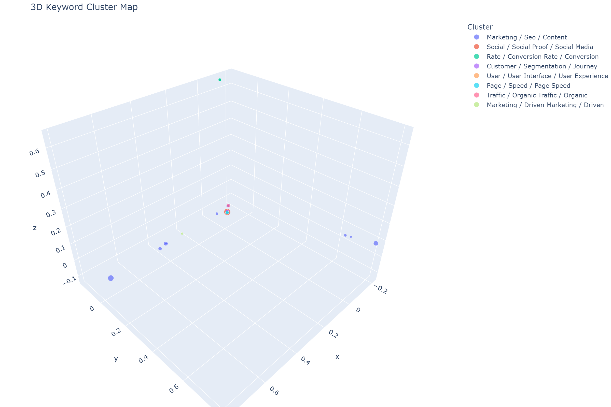
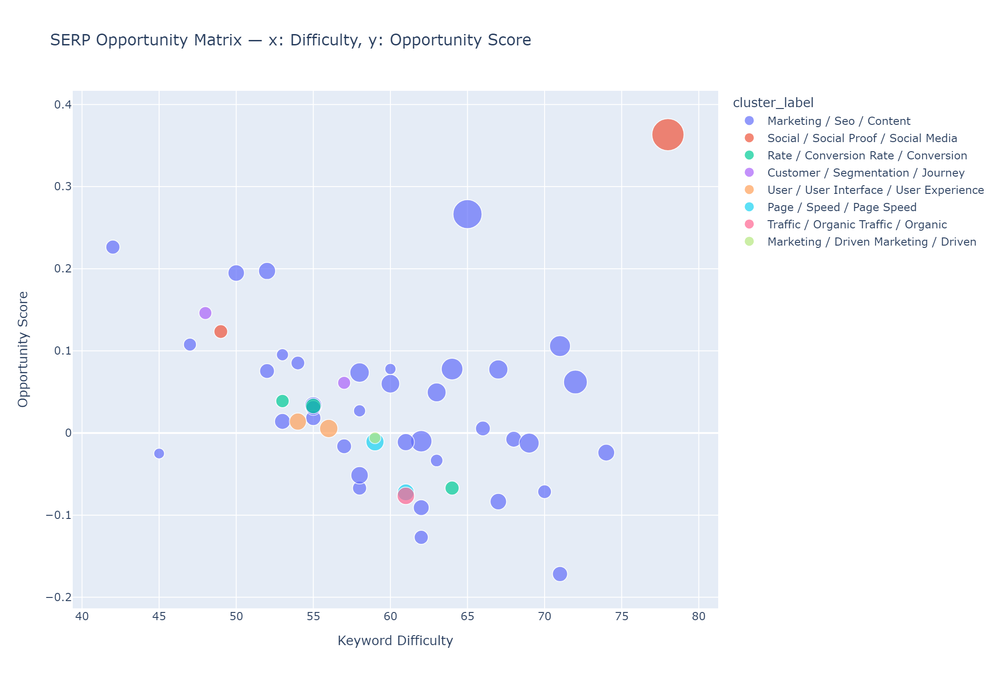
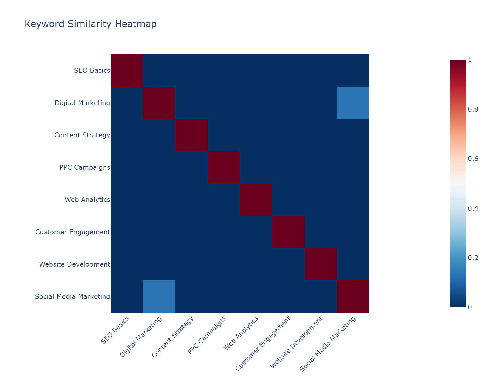

# SEO Keyword Clustering & Topic Mapping

[](https://github.com/johnoconnor0/keyword-clustering/actions/workflows/ci.yml)
[](LICENSE)
[](https://www.python.org/downloads/)
[](https://streamlit.io)

> Interactive SEO keyword clustering, page mapping, and content-gap analysis with 2D/3D visualisations, CSV exports, and a Streamlit dashboard.



---

## What it does

- **Clusters keywords** by semantic similarity (KMeans, Agglomerative, HDBSCAN)
- **Maps keyword groups** to your website pages via cosine similarity
- **Detects content gaps** — keywords with no suitable target page
- **Flags cannibalization** — clusters where multiple pages compete for the same intent
- **Flags page mismatches** — keywords currently ranking on the wrong page
- **Scores opportunities** — prioritises keywords by volume, difficulty, and ranking gap
- **Auto-labels clusters** from top TF-IDF terms
- **Supports SERP feature columns** — featured snippet, local pack, PAA, image pack, video
- **Generates visual reports** — interactive 3D scatter, treemap, Sankey, heatmap, opportunity matrix, network graph
- **Exports CSV + Markdown reports** — clustered keywords, page map, gap report, cannibalization report, cluster summary, recommendations

---

## Quickstart

```bash
# 1. Clone and install
git clone https://github.com/johnoconnor0/keyword-clustering.git
cd keyword-clustering
pip install -r requirements.txt

# 2. Download NLTK stopwords (one-time)
python -c "import nltk; nltk.download('stopwords')"

# 3. Run the CLI with example data
python -m keyword_clustering.cli run \
  --keywords examples/sample_keywords.csv \
  --pages    examples/sample_pages.csv \
  --topics   examples/sample_topics.csv \
  --clusters 8 \
  --method   kmeans \
  --output   outputs/
```

All outputs are written to `outputs/`.

---

## Streamlit dashboard

```bash
streamlit run app/streamlit_app.py
```

Upload your CSV files in the sidebar, choose a clustering method and embedding model, then explore clusters interactively across six tabs. Download all outputs — CSVs, Markdown, PNGs, and a self-contained HTML report — directly from the Exports tab.



---

## Docker

```bash
docker build -t keyword-clustering .
docker run -p 8501:8501 keyword-clustering
# Open http://localhost:8501
```

---

## CLI reference

```bash
python -m keyword_clustering.cli run \
  --keywords  <path>          # required: CSV with 'keyword' column
  --pages     <path>          # optional: CSV with 'url', 'page_name'
  --topics    <path>          # optional: CSV with 'topic'
  --clusters  8               # number of clusters (default: 8)
  --method    kmeans          # kmeans | agglomerative | hdbscan
  --embedding tfidf           # tfidf | all-MiniLM-L6-v2 (or any ST model name)
  --reduction pca             # pca | umap | tsne
  --output    outputs/        # output directory
  --brand     acme weblifter  # brand terms for branded/non-branded flagging
```

---

## Input CSV format

### Keywords (required)

| Column | Required | Description |
|---|---|---|
| `keyword` | Yes | The keyword string |
| `search_volume` | No | Monthly search volume |
| `keyword_difficulty` | No | 0–100 difficulty score |
| `cpc` | No | Cost per click |
| `current_url` | No | Page currently ranking for this keyword |
| `rank` | No | Current ranking position |
| `clicks` | No | Monthly clicks |
| `impressions` | No | Monthly impressions |
| `ctr` | No | Click-through rate |
| `intent` | No | Pre-set intent (otherwise auto-detected) |
| `featured_snippet` | No | 1 if keyword triggers a featured snippet |
| `local_pack` | No | 1 if keyword triggers a local pack |
| `people_also_ask` | No | 1 if PAA box appears |
| `image_pack` | No | 1 if image pack appears |
| `video_result` | No | 1 if video results appear |

### Pages (optional)

| Column | Required |
|---|---|
| `url` | Yes |
| `page_name` | Yes |

### Topics (optional)

| Column | Required |
|---|---|
| `topic` | Yes |

---

## Output files

| File | Content |
|---|---|
| `clustered_keywords.csv` | All keywords with cluster, page, intent, scores, notes |
| `keyword_page_map.csv` | Keyword → page assignments with similarity scores |
| `content_gap_report.csv` | Keywords with no suitable page |
| `cannibalization_report.csv` | Clusters with competing pages |
| `cluster_summary.csv` | Per-cluster metrics and top keywords |
| `recommendations.md` | Plain-English strategy per cluster |
| `cluster_map_3d.html` | Interactive 3D Plotly scatter |
| `cluster_map_2d.html` | Interactive 2D topic map |
| `treemap.html` | Cluster treemap by volume |
| `heatmap.html` | Keyword similarity heatmap |
| `sankey.html` | Page → cluster Sankey diagram |
| `opportunity_matrix.html` | SERP opportunity scatter |
| `network_graph.html` | Keyword similarity network |
| `interactive_report.html` | All charts bundled in one file |

Key output columns in `clustered_keywords.csv`:

```
keyword, cluster_id, cluster_label, primary_intent,
recommended_page, recommended_url, current_page,
page_similarity_score, topic_similarity_score,
opportunity_score, search_volume, keyword_difficulty,
cpc, rank, branded, notes
```

---

## Similarity heatmap



---

## Clustering methods

| Method | Best for |
|---|---|
| `kmeans` | Fast baseline, roughly equal-sized clusters |
| `agglomerative` | Hierarchical topic maps |
| `hdbscan` | Semantic embeddings, variable cluster sizes |

## Embedding models

| Option | Speed | Quality |
|---|---|---|
| `tfidf` (default) | Fast, no download | Good for keyword-level matching |
| `all-MiniLM-L6-v2` | ~200 MB download | Better semantic grouping |
| Any Sentence Transformers model name | Varies | Custom models |

## Dimensionality reduction

| Option | Notes |
|---|---|
| `pca` | Fast, deterministic (default) |
| `umap` | Better cluster separation, requires `umap-learn` |
| `tsne` | Good for visualisation, slower |

---

## Project structure

```
keyword-clustering/
  keyword_clustering/
    cli.py              Entry point (argparse)
    preprocessing.py    Text cleaning, CSV loading, intent + SERP tag support
    vectorization.py    TF-IDF and Sentence Transformer embeddings
    clustering.py       KMeans, Agglomerative, HDBSCAN + PCA/UMAP/t-SNE reduction
    scoring.py          Similarity, page mapping, gap/cannibalization, notes
    labeling.py         Auto cluster label generation
    visualization.py    All Plotly chart functions
    export.py           CSV and HTML report writers
  app/
    streamlit_app.py    Interactive dashboard
  examples/
    sample_keywords.csv
    sample_pages.csv
    sample_topics.csv
    output_clustered_keywords.csv
    interactive_report.html
    screenshots/
      3d_cluster_plot.png
      dashboard.png
      heatmap.png
      opportunity_matrix.png
  docs/
    index.md
    cli.md
    outputs.md
  tests/
    test_preprocessing.py
    test_scoring.py
    test_clustering.py
  Dockerfile
```

---

## Running tests

```bash
pytest tests/ -v
```

Tests run across Python 3.10, 3.11, and 3.12 in CI.

---

## Contributing

See [CONTRIBUTING.md](CONTRIBUTING.md).

## License

[MIT](LICENSE)
